# IF3210-2022-Android-11

## Deskripsi Aplikasi
Aplikasi yang dibuat adalah aplikasi kesehatan (peduli lindungi versi lite) yang dapat menampilkan berita covid, melihat dan membookmark faskes di Indonesia, dan melakukan scan qr-code untuk check-in di suatu faskes.

## Cara Kerja
1. Menampilkan Berita COVID-19
    - Membuka halaman list berita melalui bottom navigation
    - Melihat kumpulan berita
    - Mengklik salah satu berita dan masuk ke halaman detail berita
    - Halaman detail berita menampilkan webview dari berita yang di klik
2. Menampilkan Daftar Faskes untuk Vaksinasi
    - Membuka halaman daftar faskes melalui bottom navigation
    - Memilih provinsi dengan mengklik dropdown provinsi
    - Memilih kota dengan mengkil dropdown kota
    - Menekan tombol search
    - Akan ditampilkan 5 daftar faskes terdekat yang bersesuaian
    - Apabila android di rotate maka tampilan akan berubah
    - Pengguna dapat memilih satu faskes untuk menampilkan daftar faskes
3. Menampilkan Detail Informasi Faskes
    - Daftar faskes untuk vaksinasi sudah terdapat di layar
    - Memilih salah satu faskes dan masuk ke halaman detail faskes yang bersesuaian
    - Akan ditampilkan daftar faskes yang bersesuaian beserta status vaksinasi faskes tersebut
    - Pengguna dapat menekan tombol google map untuk membuka faskes melalui google map
    - Pengguna dapat menekan tombol bookmark untuk melakukan bookmark faskes
4. Menampilkan Daftar Bookmark Faskes
    - Membuka halaman bookmark faskes melalui bottom navigation
    - Akan ditampilkan list faskes yang di bookmark.
    - Pengguna dapat memilih salah satu faskes untuk menampilkan detail faskes
5. Melakukan "Check-in"
    - Pengguna menekan floating button yang ada di kanan atas bottom navigation
    - Pengguna akan masuk ke mode scanning
    - Pengguna mengarahkan kamera ke qrcode yang akan di scan
    - Apabila qrcode valid maka aplikasi akan menampilkan status check-in beserta alasan jika diperlukan

## Library
1. Retrofit, digunakan untuk melakukan request GET dan POST ke API PerludiLindungi
2. Google Maps Service, untuk mendapatkan lokasi titik dari pengguna
3. Picasso, digunakan untuk menampilkan gambar dari URL yang diberikan
4. budiyev/code-scanner digunakan untuk melakukan scanning qr code

## Screenshot
| Name | Preview |
|------|---------|
| News | 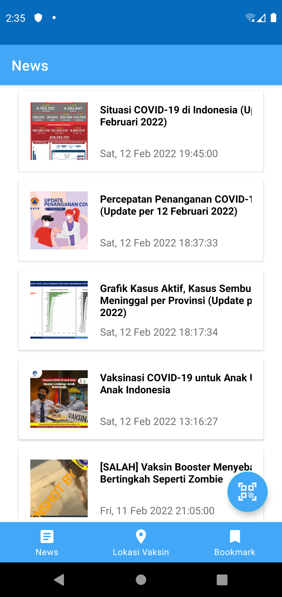 |
| Detail News | 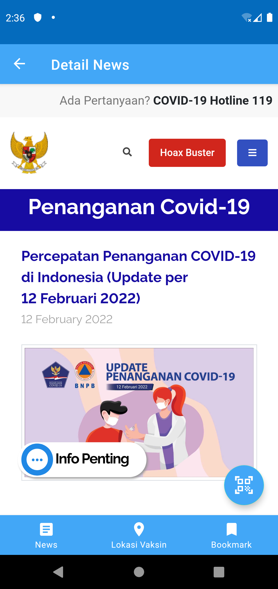 |
| Daftar Faskes | 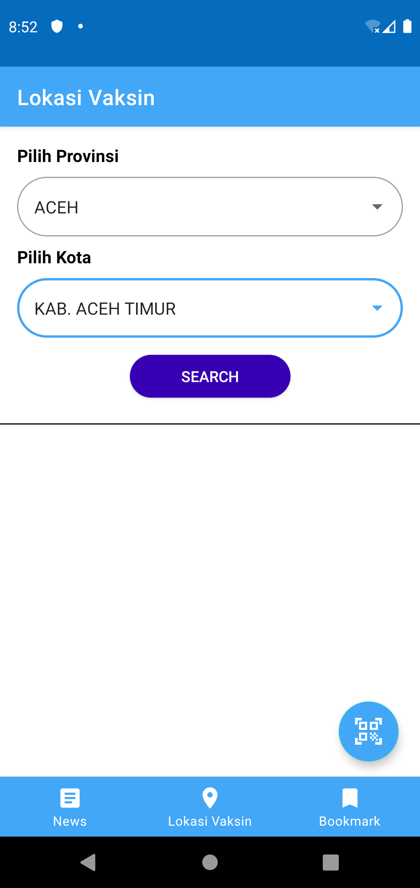 |
| Daftar Faskes Searched | 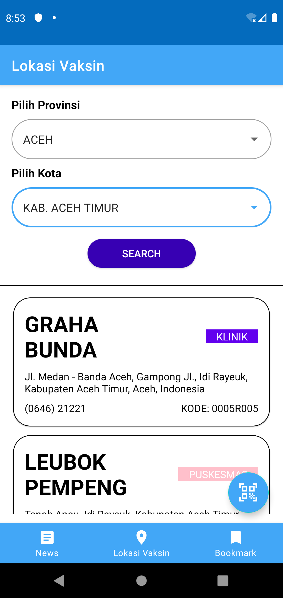 |
| Daftar Faskes Landscape | 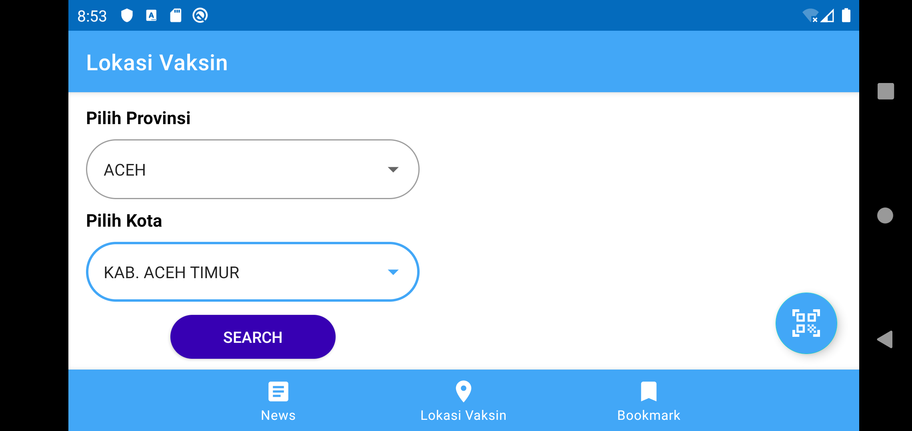 |
| Daftar Faskes Landscape Searched | 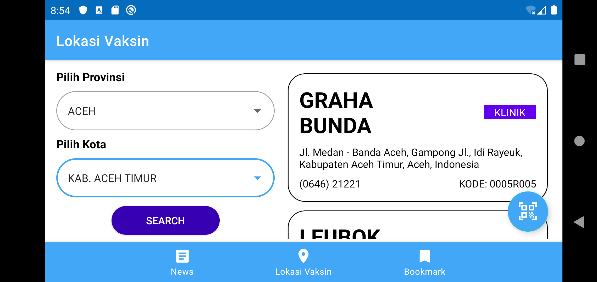 |
| Detail Faskes Siap Vaksinasi |  |
| Detail Faskes Tidak Siap Vaksinasi |  |
| Google Maps Faskes |  |
| Bookmark Faskes |  |
| QRCode | 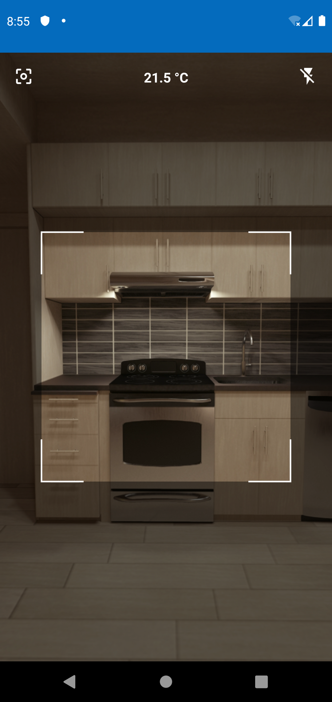 |
| QRCode Red | 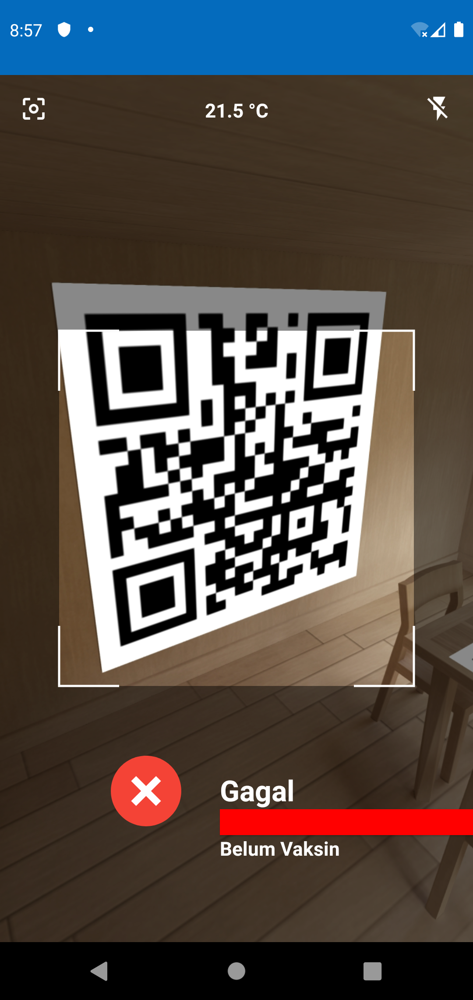 |
| QRCode Green | 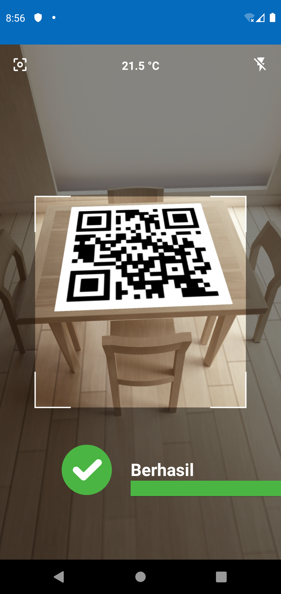 |
| QRCode Yellow | 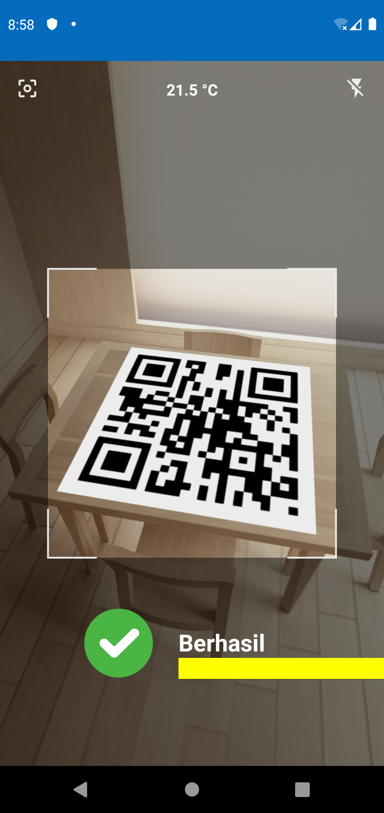 |
| QRCode Black | 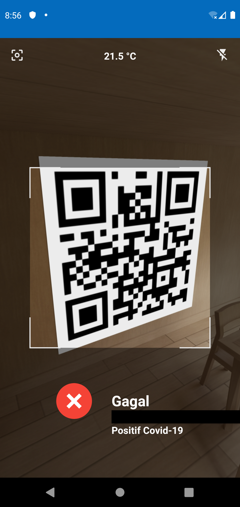 |

## Pembagian Tugas
1. 13519014 Mahameru DS

2. 13519043 Reihan Andhika Putra
    - Membuat bottom navigation
    - Init Retrofit + seluruh model request/response
    - Membuat list news
    - Membuat detail news
    - Membuat halaman list faskes (search city, search province, search faskes, get lokasi, sort faskes)
    - Membuat halaman list faskes landscape (search city, search province, search faskes, get lokasi, sort faskes)
    - Membuat halaman qrcode (get suhu, get lokasi, scan, POST check-in)

3. 13519044 Kinantan Ariya Bagaspati